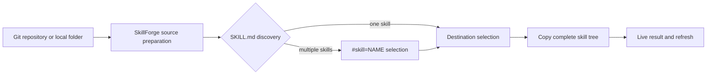

<div align="center">

# SkillForge

### Local-first installer for AI agent skills

Install portable `SKILL.md` workflows into Kilo Code, Codex, Claude Code, Gemini CLI and other compatible agents — from one calm, focused workspace.

<p>
  <a href="https://github.com/jgchkcu-maker/SkillForge/stargazers"></a>
  <a href="https://github.com/jgchkcu-maker/SkillForge/issues"></a>
  <a href="https://github.com/jgchkcu-maker/SkillForge"></a>
  <a href="https://github.com/jgchkcu-maker/SkillForge/blob/main/README.md"></a>
</p>

<p>
  <a href="#quick-start">Quick start</a> ·
  <a href="#what-it-does">What it does</a> ·
  <a href="#supported-agents">Supported agents</a> ·
  <a href="#contributing">Contributing</a>
</p>

</div>

---

## What it does

SkillForge turns skill installation into a small, inspectable workflow:

| Discover | Choose | Install | Verify |
| --- | --- | --- | --- |
| Finds local projects and compatible AI tools | Shows only valid destinations | Copies a complete skill with its resources | Streams progress and reports the exact failure |

It is designed for people who work across several coding agents and want one project-aware place to manage reusable workflows.

### Why SkillForge

- **Project-aware** — installs into the selected workspace instead of guessing.
- **Multi-agent** — one source can be installed to several compatible destinations.
- **Local-first** — the app runs on `127.0.0.1`; no hosted account is required.
- **Transparent** — every installation has a live operation log.
- **Safe by default** — existing skills are preserved unless replacement is explicitly enabled.
- **Portable** — follows the open `SKILL.md` format used across modern coding agents.

## Quick start

### Requirements

- Windows 10 or newer
- Python 3.10+
- Git

### 1. Download the repository

```powershell
git clone https://github.com/jgchkcu-maker/SkillForge.git
cd SkillForge
```

### 2. Install the backend dependencies

```powershell
python -m pip install -r requirements.txt
```

### 3. Launch SkillForge

Double-click [`start-skill-forge.bat`](start-skill-forge.bat), or run:

```powershell
.\start-skill-forge.bat
```

The launcher starts the local backend and opens:

<http://127.0.0.1:8765>

## Install your first skill

1. Open the **Installation** page.
2. Select a green, ready destination such as **Kilo Code**.
3. Paste a Git repository URL.
4. Choose **This project** or **All projects**.
5. Click **Install** and follow the live journal.

For repositories containing multiple skills, select one with a `#skill=` fragment:

```text
https://github.com/bergside/awesome-design-skills.git#skill=codex
```

The selected skill will be copied to:

```text
<your-project>/.kilo/skills/<skill-name>/SKILL.md
```

## Useful examples

| Use case | Source |
| --- | --- |
| Frontend design guidance | `https://github.com/vercel-labs/agent-skills.git#skill=frontend-design` |
| Design review | `https://github.com/microsoft/skills.git#skill=frontend-design-review` |
| MCP server development | `https://github.com/microsoft/skills.git#skill=mcp-builder` |
| Planning and analysis | `https://github.com/jMerta/codex-skills.git#skill=plan-work` |
| Taste and visual quality | `https://github.com/Leonxlnx/taste-skill.git#skill=taste-skill` |

Always inspect third-party `SKILL.md` files before installing them. Skills are instructions that an agent may follow and can include scripts or referenced resources.

## Supported agents

SkillForge currently detects and routes skills for:

| Agent | Project location | Global location |
| --- | --- | --- |
| Kilo Code | `.kilo/skills` | `~/.kilo/skills` |
| OpenAI Codex | `.agents/skills` | `$CODEX_HOME/skills` |
| Claude Code | `.claude/skills` | `~/.claude/skills` |
| Gemini CLI | `.gemini/skills` | `~/.gemini/skills` |
| Cline | `.cline/skills` | `~/.cline/skills` |
| Roo Code | `.roo/skills` | `~/.roo/skills` |
| GitHub Copilot CLI | `.github/skills` | `~/.copilot/skills` |

Availability depends on what is detected on the machine. A destination is shown as ready only when SkillForge has a known compatible path for it.

## How it works



The Flask backend owns discovery, validation, installation and streamed logs. The React frontend is a deliberately small local control surface over that backend.

## Development

Backend:

```powershell
python skill-forge/app.py
```

Frontend development server:

```powershell
cd skill-forge
pnpm install
pnpm dev
```

Production frontend build:

```powershell
cd skill-forge
pnpm build
```

Run the focused tests from the repository root:

```powershell
python -m unittest test_skillforge_agents.py
```

## Project structure

```text
SkillForge/
├── skill-forge/              # React UI and Flask app shell
│   ├── src/                  # Frontend source
│   └── app.py                # Local API and job stream
├── agent_registry.py         # Agent destinations and capabilities
├── artifact_installer.py     # Skill, agent and MCP installation logic
├── detector.py               # Local agent detection
├── skill_installer.py        # Legacy package and project helpers
├── start-skill-forge.bat     # Windows launcher
└── test_skillforge_agents.py # Focused integration tests
```

## Contributing

Issues and pull requests are welcome. A useful contribution usually includes:

1. A short description of the user problem.
2. The smallest focused change that solves it.
3. A reproducible test or verification note.
4. Any new agent path or format assumptions documented in the registry.

Please do not commit local `.kilo/`, `.kilocode/`, `node_modules/`, credentials or generated logs.

## Security note

SkillForge copies and installs instructions from sources you provide. Treat external skills as untrusted input: review `SKILL.md`, inspect bundled scripts, and install only from sources you trust.

## License

No license file has been added yet. Until a license is published, all rights remain with the repository owner.

<div align="center">

Made for calmer, more portable AI coding workflows.

</div>
